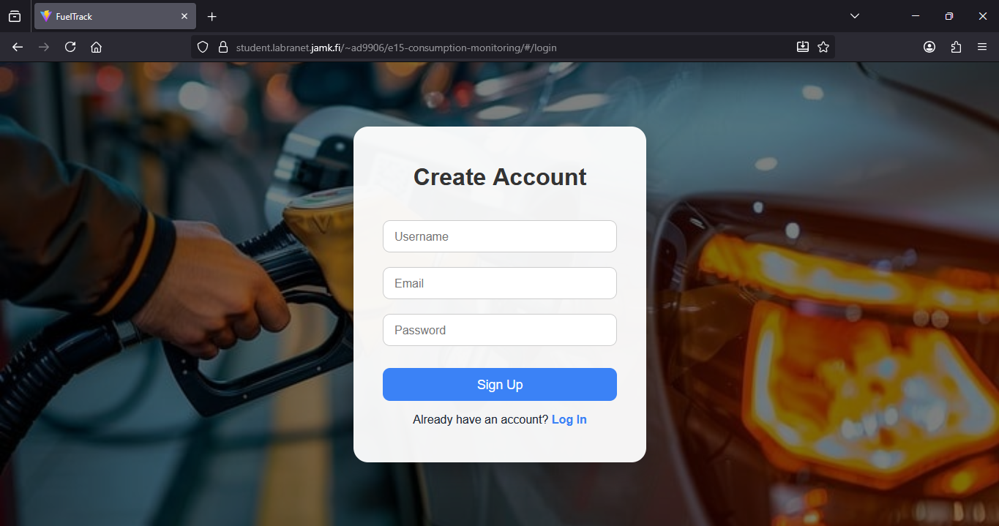
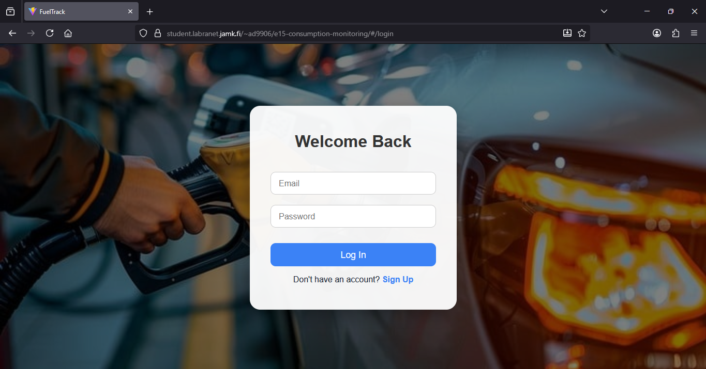
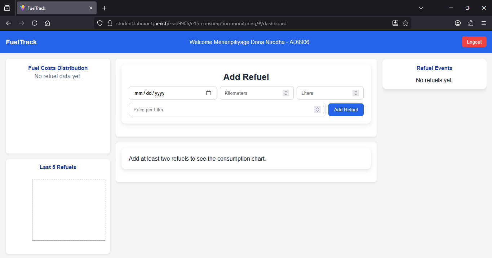
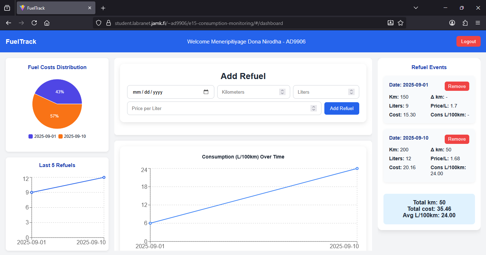
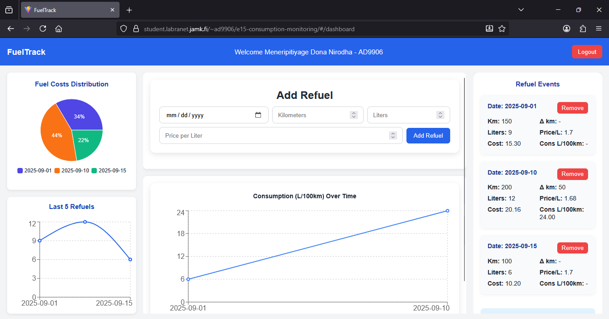

# Fuel Consumption Dashboard

A React-based fuel tracking application for recording refueling events, monitoring fuel consumption, and visualizing vehicle costs through an interactive dashboard.

[](https://github-portfolio-313v.onrender.com/~ad9906/e15-consumption-monitoring/#/login)

## Features

- User signup and login
- Add and remove refueling records
- Track date, kilometers, liters, and fuel price
- Calculate fuel consumption in **L/100 km**
- View total distance and fuel-cost summaries
- Interactive charts for consumption and costs
- Data persistence using `localStorage`

## Tech Stack

`React` · `Redux Toolkit` · `React Router` · `Recharts` · `Vite` · `JavaScript` · `CSS`

## Screenshots

### Signup & Login

<table>
  <tr>
    <td align="center">
      
      <br>
      <sub><b>Signup Page</b></sub>
    </td>
    <td align="center">
      
      <br>
      <sub><b>Login Page</b></sub>
    </td>
  </tr>
</table>

### Dashboard

<p align="center">
  
</p>

<p align="center">
  
</p>

<p align="center">
  
</p>

## Run Locally

```bash
npm install
npm run dev
```

Then open the local Vite URL shown in the terminal.

## Notes

Application data is stored in the browser using `localStorage`, so records remain available between sessions on the same browser.